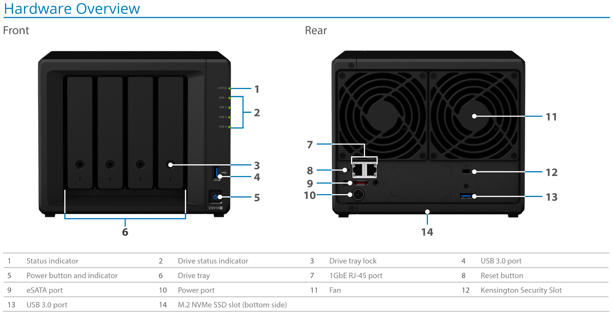

# Welcome!

:::warning[Do not connect your Smart TV to the internet!]

The provided Onn streaming box and the Synology NAS should be the only devices to have internet access.

Failure to heed this warning will lead to unexpected behavior.
:::

To set up your Synology NAS and ensure Plex is working, follow these steps:

## Hardware Overview

1. **Plug in the NAS**: Locate the power port on the back of your NAS (labeled as 10 in the diagram). Connect the power adapter to this port and plug it into a wall outlet. Press the power button on the front (labeled as 5) to turn on the NAS. Ensure it is placed in a stable and ventilated area to prevent overheating.

2. **Connect the Ethernet Cable**: Find the leftmost RJ-45 port on the back of the NAS (labeled as 7). Connect one end of an Ethernet cable to this port and the other end to your router. This connection allows the NAS to communicate with your network and access the internet.

3. **Wait for the Beep**: Once powered on, the NAS will go through its startup process. Wait for the beep sound, which indicates that the NAS is ready for use. This may take a few minutes, so be patient.

4. **Connect Onn to Your TV**: Plug the Onn streaming device into an available HDMI port on your TV. Use the included HDMI cable.

5. **Power Onn**: Connect the Onn streaming device to power using the included Micro USB cable.

6. **Connnect Wi-Fi**: Go up to the Settings gear and select it.
Select System Settings
From the System Settings menu, ollow the on-screen instructions to connect the device to your Wi-Fi network. Use the remote to select your network and enter the password. Ensure you have a stable internet connection for optimal streaming performance.

