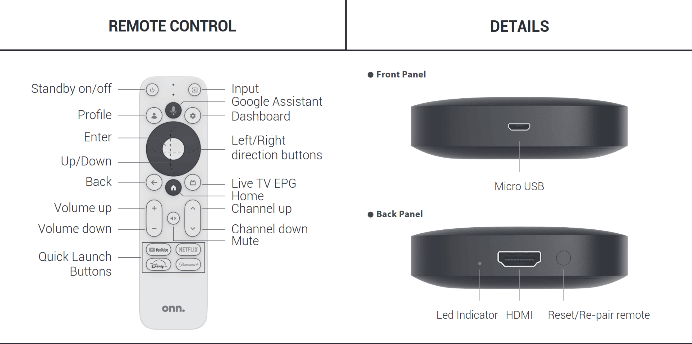

# Welcome!

## Hardware Overview

### Synology DS918+

### onn 4K Streaming Box Google TV (2023)

## Hardware Setup

:::warning[Do not connect your Smart TV to the internet!]

The Synology NAS and accompanying Onn streaming box should be the *only* "TV" devices to have internet access.

Directly connecting any smart TV to your network *is not supported*, and doing so may lead to unpredictable results.
:::

To set up your Synology NAS, follow these steps. 

1. **Plug in the NAS**: Locate the power port on the back of your NAS (labeled as 10 in the diagram). Connect the power adapter to this port and plug it into a wall outlet. Press the power button on the front (labeled as 5) to turn on the NAS. Ensure it is placed in a stable and ventilated area to prevent overheating.

2. **Connect the Ethernet Cable**: Find the leftmost Ethernet port on the back of the NAS (labeled as 7). Connect one end of an Ethernet cable to this port and the other end to your router. This connection allows the NAS to communicate with your network and access the internet.

3. **Wait for the Beep**: Once powered on, the NAS will go through its startup process. Wait for the beep sound, which indicates that the NAS is almost ready for use. This may take a few minutes, so be patient.

4. **TV Onn**: Plug the Onn streaming device into an available HDMI port on your TV. Use the included HDMI cable.

5. **Power Onn**: Connect the Onn streaming device to power using the included Micro USB cable. Wait for the Onn streaming box to boot to its Home screen. This may take a few minutes, so be patient.

6. **Wi-Fi Onn**: Go up to the Settings gear and select it. From the settings menu that appears, select System Settings. Follow the on-screen instructions to connect the device to your Wi-Fi network. Use the remote to select your network and enter the password. Ensure you have a stable internet connection for optimal streaming performance.

7. **Plex Onn**: From the Home screen, open Plex and confirm that your Movies and your TV Shows are accessible. Play any movie or episode to verify that Plex functions as expected.

Congratulations! Once Plex is up and running, sit back and enjoy the show. 🍿
