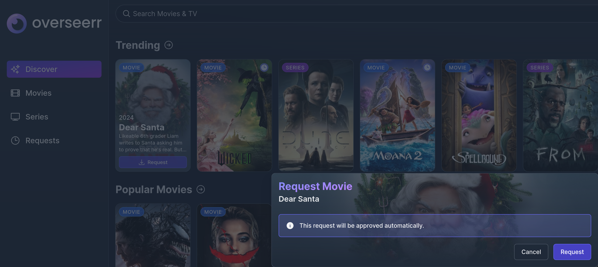
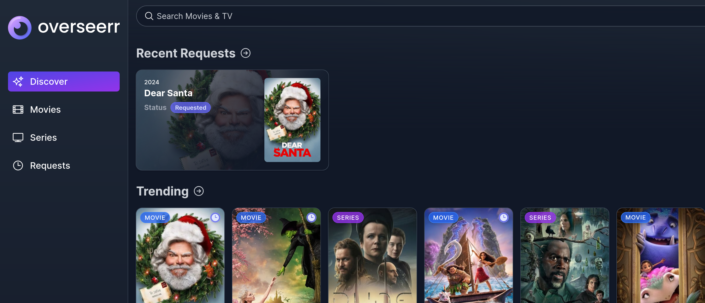
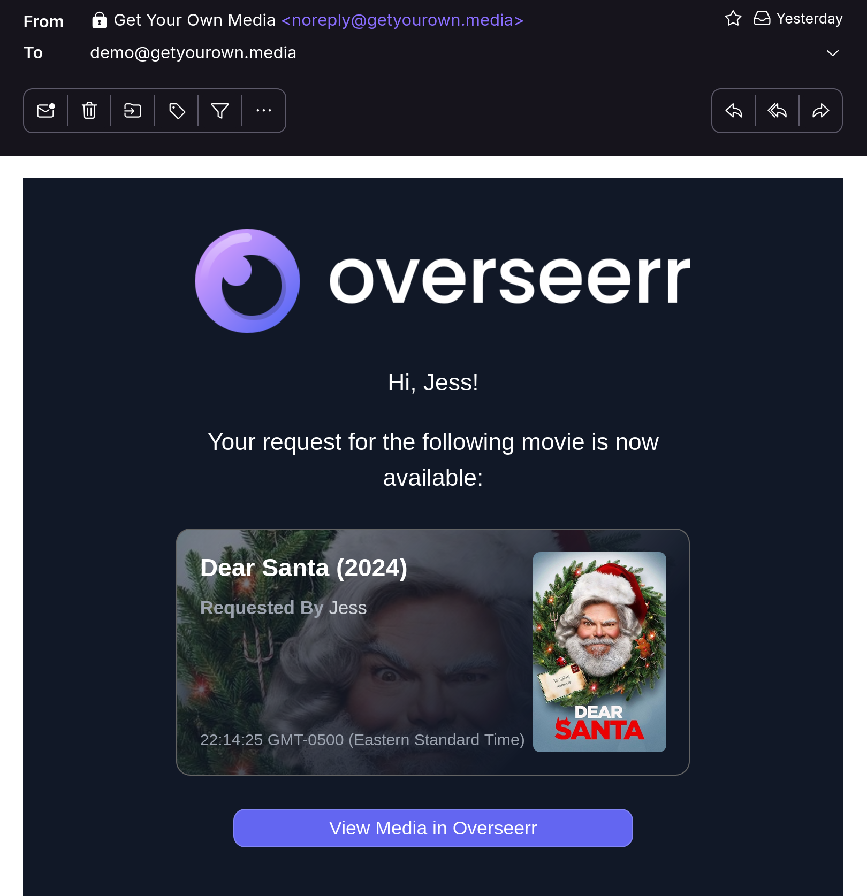

# Get More Media

Your server is preloaded with a selection of ready-to-watch movies and TV shows. In the mood for something different? 

**Overseerr** is a user-friendly request system that can automatically search for and grab the media you're after. To access Overseer, visit **http://{frontMatter.server}:5055**.

1. Search for and request any Movie or TV Show.

    

    

2. Each request will be automatically downloaded (where available), and added to your Plex library. You can also opt to recieve notifications via email or mobile (push) when your media is ready to enjoy.

    

